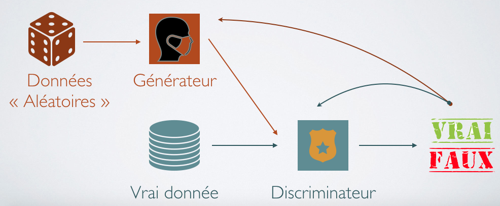

# Réseaux adverses génératifs


## Principe

Un RAG est un modèle génératif où deux réseaux sont placés en 
compétition.
Le premier réseau est le générateur, il génère un échantillon (ex. du bruit = pire cas)
, tandis que son adversaire, le discriminateur essaye de détecter si un échantillon est réel ou
 bien s'il est le résultat du générateur. 


 <!-- .element height="50%" width="50%" -->

## Cycle Gan
Le CycleGan est une technique de GAN qui permet d'entrainer
des modèles de génération d'image, de type image-to-image, sans exemples apairés.

Le CycleGan permet de passer d'une image à une autre via deux générateurs
différents.
 
## Examples


## Comment débuter ?

### -- Prérequis --

```
Installer les prérequis issu du fichier requirements.txt
Installer tensorflow > 2.0.0
```

### -- Installation --
<ul>
<p>
Docker
</p>
</ul>
Vous pouvez directement créer un environnement stable via docker
Depuis le répertoire principal, executer la commande

```
docker build -t cyclegan .
docker run -it --name cycleganC cyclegan
```
<hr>
<ul>
<p>
Déploiement cloud
</p>
</ul>

Vous pouvez suivre cette procedure pour déployer une machine virtuel sur Google Cloud
```
Créer une instance 'Deep Learning VM '
8vCPU, 30 Gb RAM, GPU NVIDIA P100.
Copier votre clef publique dans la VM, afin de pouvoir y acceder en SSH.
Copier le contenu du projet "AIF_CycleGan" via un scp -r
Mettre à jour les prérequis avec mise_a_jour.sh
Lancer main.py ou un tunneling SSH pour utiliser le notebook.
```
Tunneling SSH
```
Depuis la VM: 
jupyter notebook --no-browser --port=8080
Depuis l'ordinateur local
ssh -N -L 8080:localhost:8080 <IDuser>@<ipVM>
```

## Pour faire tourner le cycleGan
```
python3 main.py
```
Les arguments suivants peuvent être ajoutés.
```
'--dataset', default='ukiyoe2photo'
'--batch_size', type=int, default=1
'--epochs', type=int, default=50
'--cycle_loss_weight', type=float, default=10.0
'--identity_loss_weight', type=float, default=0
```
Le fichier main.py va générér les différents réseaux, et lancer la phase d'entrainement, des checkpoints sont créés toutes les 5 epochs afin de pouvoir fractionner la phase d'entrainement.

## Quelques résultats

### Arrière plan flou <-> Arrière plan net (100 epochs)


<hr>

### Style Ukiyo-e  <-> Photo (41 epochs)


## License

This project is licensed under the MIT License - see the [LICENSE.md](LICENSE.md) file for details

## Sources

* DCGAN : https://arxiv.org/pdf/1511.06434.pdf
* CycleGAN: https://arxiv.org/pdf/1703.10593.pdf
https://hardikbansal.github.io/CycleGANBlog/
* cGAN : https://arxiv.org/pdf/1611.07004.pdf
